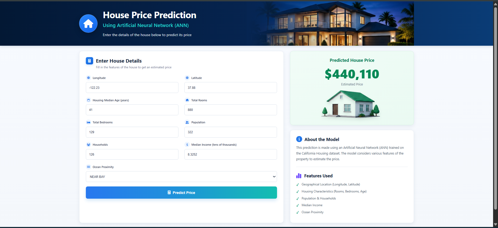

# 🏠 House Price Prediction Using ANN

An end-to-end Deep Learning project for predicting median house prices in California using an Artificial Neural Network (ANN).

The project covers data preprocessing, categorical encoding, feature scaling, ANN training and evaluation, and deployment through a responsive Flask web application.

---

## 🌐 Web Application



The web application provides a clean and responsive interface where users can enter housing information and receive a predicted median house value generated by the trained Artificial Neural Network.

---

## 📌 Project Overview

The main objective of this project is to predict the `median_house_value` using geographical, demographic, and housing-related information from the California Housing dataset.

The complete project workflow includes:

- Data loading and exploration
- Data preprocessing
- Missing value handling
- One-Hot Encoding
- Train/Test splitting
- Feature scaling
- Artificial Neural Network development
- Model training
- Model evaluation
- Model and scaler saving
- Flask backend development
- Responsive web interface
- Real-time house price prediction

---

## 📊 Dataset

The project uses the California Housing dataset.

Each row represents information about a California census block group rather than an individual house.

### Original Features

- `longitude`
- `latitude`
- `housing_median_age`
- `total_rooms`
- `total_bedrooms`
- `population`
- `households`
- `median_income`
- `median_house_value`
- `ocean_proximity`

### 🎯 Target Variable

The prediction target is:

```text
median_house_value
```

---

## 🧹 Data Preprocessing

Several preprocessing steps were applied before training the ANN.

### Missing Values

Missing values in:

```text
total_bedrooms
```

were handled before model training.

### One-Hot Encoding

The categorical feature:

```text
ocean_proximity
```

was converted using One-Hot Encoding.

The generated categories are:

- `<1H OCEAN`
- `INLAND`
- `ISLAND`
- `NEAR BAY`
- `NEAR OCEAN`

After encoding, the ANN receives a total of **13 input features**.

### Feature Scaling

A `MinMaxScaler` was used to scale the input features.

The fitted scaler is saved as:

```text
scaler.pkl
```

and is reused by the Flask application during prediction.

---

## 🧠 Artificial Neural Network

The model was built using TensorFlow/Keras.

### Model Architecture

| Layer | Neurons | Activation |
|---|---:|---|
| Input | 13 Features | - |
| Dense Layer 1 | 1000 | ReLU |
| Dense Layer 2 | 500 | ReLU |
| Dense Layer 3 | 250 | ReLU |
| Output Layer | 1 | Linear |

The output layer contains one neuron because this is a regression problem.

---

## ⚙️ Model Configuration

The model was compiled using:

- **Optimizer:** RMSprop
- **Loss Function:** Mean Squared Error (MSE)
- **Evaluation Metric:** Mean Absolute Error (MAE)

Training configuration:

- **Epochs:** 10
- **Batch Size:** 50
- **Validation Data:** Test split

Early Stopping was also used to monitor validation loss and restore the best model weights.

---

## 📈 Model Performance

The trained ANN achieved approximately:

| Metric | Result |
|---|---:|
| MAE | $50,708 |
| MSE | 4,913,419,384 |
| RMSE | $70,096 |
| R² Score | 0.625 |

An R² score of approximately **0.625** means that the model explains around **62.5% of the variation in median house values**.

---

## 🔄 Prediction Pipeline

When a user enters data through the website, the application follows this pipeline:

```text
User Input
    ↓
Flask Backend
    ↓
One-Hot Encoding
    ↓
MinMaxScaler
    ↓
Artificial Neural Network
    ↓
Predicted House Price
```

The Flask application recreates the same ANN architecture and loads the trained weights from:

```text
model_weights.weights.h5
```

---

## 💻 Web Application Features

The application allows the user to enter:

- Longitude
- Latitude
- Housing Median Age
- Total Rooms
- Total Bedrooms
- Population
- Households
- Median Income
- Ocean Proximity

After clicking **Predict Price**, the application preprocesses the inputs and displays the predicted house value.

---

## 🧪 Example Prediction

Example input:

```text
Longitude: -122.23
Latitude: 37.88
Housing Median Age: 41
Total Rooms: 880
Total Bedrooms: 129
Population: 322
Households: 126
Median Income: 8.3252
Ocean Proximity: NEAR BAY
```

Example prediction generated by the ANN:

```text
$440,110
```

The predicted value may vary depending on the trained model weights and input data.

---

## 🛠️ Technologies Used

### Deep Learning & Data Processing

- Python
- TensorFlow
- Keras
- Scikit-learn
- Pandas
- NumPy

### Data Visualization

- Matplotlib

### Web Development

- Flask
- HTML5
- CSS3
- Font Awesome

### Development Tools

- Google Colab
- Visual Studio Code
- Git
- GitHub

---

## 📂 Project Structure

```text
House-Price-Prediction-Using-ANN/
│
├── app.py
├── README.md
├── requirements.txt
├── .gitignore
│
├── model_weights.weights.h5
├── scaler.pkl
│
├── data/
│   └── housing.csv
│
├── notebook/
│   └── house_price_prediction_ann.ipynb
│
├── screenshots/
│   └── app-preview.png
│
├── templates/
│   └── index.html
│
└── static/
    ├── style.css
    │
    └── images/
        ├── header-house.jpg
        └── prediction-house.png
```

---

## 📓 Jupyter Notebook

The complete model development workflow is available in:

```text
notebook/house_price_prediction_ann.ipynb
```

The notebook contains:

- Dataset loading
- Dataset inspection
- Missing value handling
- One-Hot Encoding
- Train/Test splitting
- Feature scaling
- ANN architecture
- Model training
- Early Stopping
- Model predictions
- MAE evaluation
- MSE evaluation
- RMSE evaluation
- R² evaluation
- Actual vs Predicted visualization
- Training vs Validation Loss visualization
- Model saving

---

## 📁 Dataset

The dataset used for this project is included in:

```text
data/housing.csv
```

This makes it possible to reproduce the preprocessing and training workflow directly from the repository.

---

## 🚀 Run the Project Locally

### 1. Clone the Repository

```bash
git clone https://github.com/AhmedRahim01/House-Price-Prediction-Using-ANN.git
```

### 2. Open the Project Folder

```bash
cd House-Price-Prediction-Using-ANN
```

### 3. Create a Virtual Environment

Python 3.10 is recommended for TensorFlow compatibility.

```bash
py -3.10 -m venv .venv
```

### 4. Activate the Virtual Environment

On Windows PowerShell:

```powershell
.\.venv\Scripts\Activate.ps1
```

### 5. Install Dependencies

```bash
pip install -r requirements.txt
```

### 6. Run the Flask Application

```bash
python app.py
```

### 7. Open the Website

Open the following address in your browser:

```text
http://127.0.0.1:5000
```

---

## 📦 Main Project Files

### `app.py`

Handles:

- Flask routes
- User input
- One-Hot Encoding
- Feature scaling
- ANN prediction
- Sending predictions back to the interface

### `model_weights.weights.h5`

Contains the trained ANN weights.

### `scaler.pkl`

Contains the fitted MinMaxScaler used during preprocessing.

### `templates/index.html`

Contains the structure of the web interface.

### `static/style.css`

Contains the responsive styling of the web application.

---

## ✨ Key Project Highlights

- End-to-end Deep Learning regression workflow
- Real-world California Housing dataset
- Categorical feature preprocessing
- 13 ANN input features after One-Hot Encoding
- Deep neural network with three hidden layers
- Multiple regression evaluation metrics
- Saved preprocessing pipeline
- Saved trained neural network weights
- Flask integration
- Responsive custom-designed web interface
- Reproducible Jupyter Notebook
- Git/GitHub project structure

---

## 👨‍💻 Author

**Ahmed Rahim**

Artificial Intelligence / Deep Learning Project